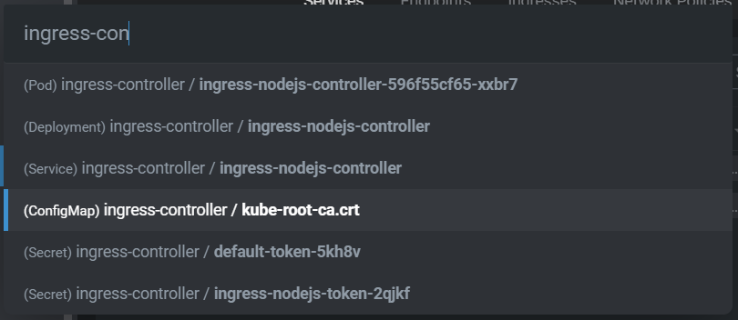

# resource-search-lens-extension

Lens extension providing a VS Code style Ctrl+P search for Kubernetes resources.

This is ALPHA software and may be buggy.

Big thanks to the authors of [lens-resource-map-extension](https://github.com/nevalla/lens-resource-map-extension) and [lens-extension-cc](https://github.com/Mirantis/lens-extension-cc) for providing examples of how to use the Lens 5 extension API.

## Installation

* Open the Extensions UI in Lens. (File > Extensions)
* Enter `resource-search-lens-extension` into the "name or file path or URL" field.
* Click "Install"
* The extension will be downloaded from NPM and installed.

## Usage

* While a cluster is focused, press Ctrl+P (or Cmd+P on Mac), or select "Search for Resource..." from the View menu.
* Start typing a name, namespace, or kind. Resources matching your query will appear in the list.
* Select a resource. Lens' detail view for the selected resource will open.

## Known Issues

* On first connecting to a cluster after Lens startup, the resources may take a few seconds to be searchable.
